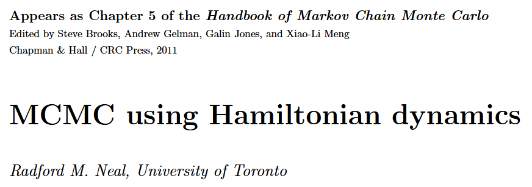
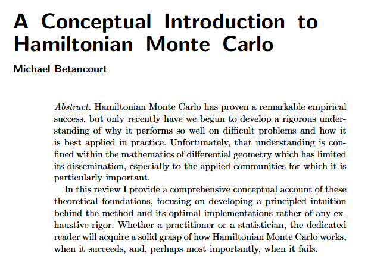
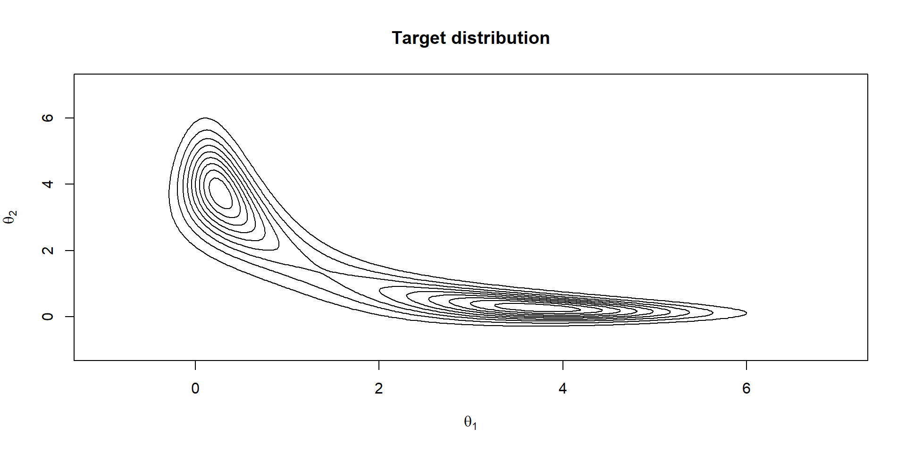
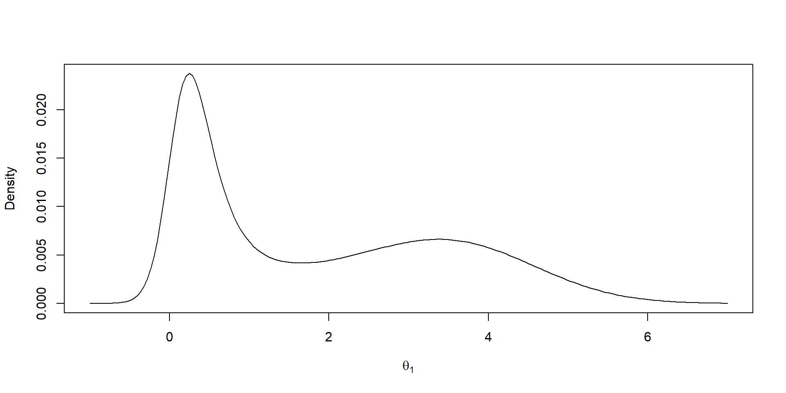
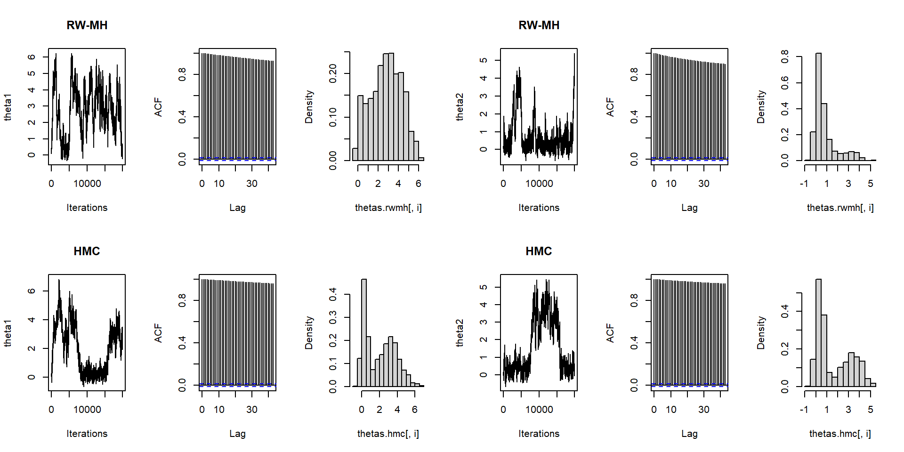
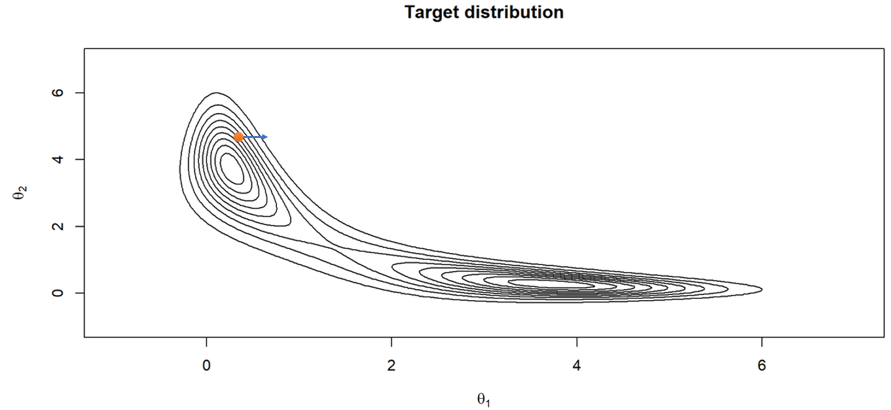
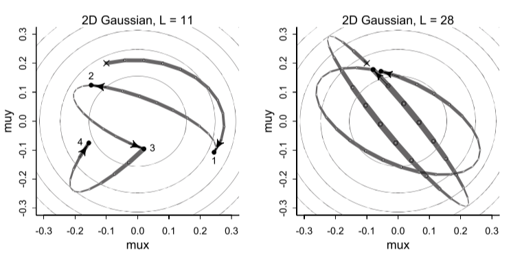
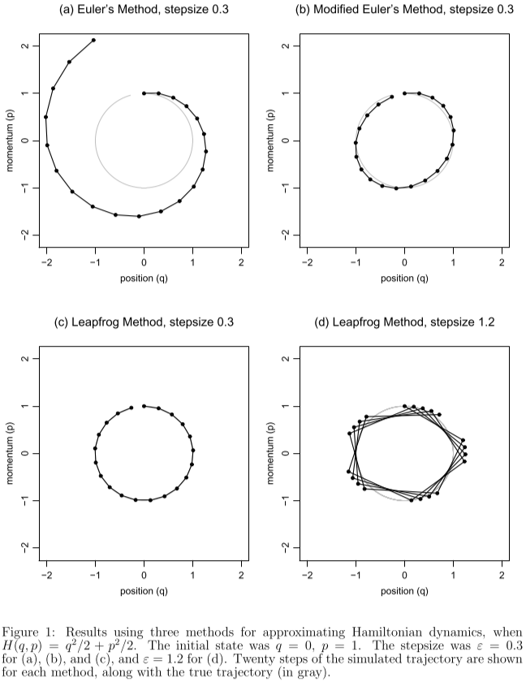
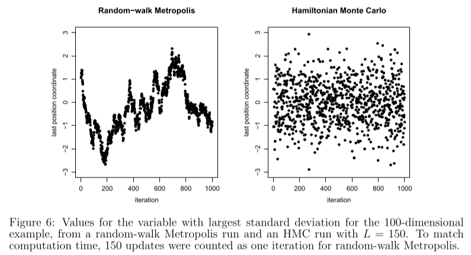
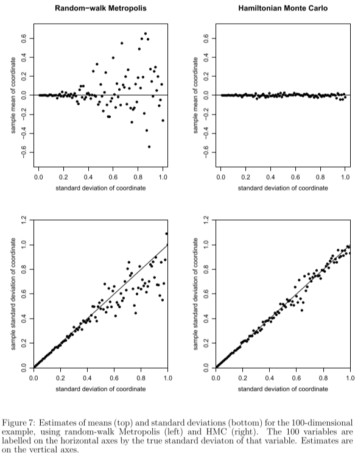

## Sumário

1.  Introdução

    Referências, contexto e exemplo inicial

2.  Hamiltonian Monte Carlo

    HMC, Amostragem no HMC, Dinâmica Hamiltoniana, Discretização e Exemplo

3.  Código

# Introdução

## Artigo 1

## Artigo 2

## Outras Referências

-   [Ben Lambert - A Student's Guide to Bayesian Statistics](https://www.youtube.com/playlist?list=PLwJRxp3blEvZ8AKMXOy0fc0cqT61GsKCG)
-   [Richard McElreath - Statistical Rethinking (2nd Ed.)](https://xcelab.net/rm/statistical-rethinking/)
-   [Hedibert Lopes](http://hedibert.org/wp-content/uploads/2021/02/hmc-example.html) - [Hamiltonian MC: a toy example](http://hedibert.org/wp-content/uploads/2021/02/hmc-example.html)

## Contexto

-   **Markov Chain Monte Carlo (MCMC)** originated with the classic paper of **Metropolis et al. (1953)**, where it was used to **simulate the distribution of states** for a system of idealized molecules.
-   Not long after, **another approach to molecular simulation** was introduced (**Alder and Wainwright, 1959**), in which the motion of the molecules was deterministic, following Newton's laws of motion, which have an elegant formalization as **Hamiltonian dynamics**.

## Contexto

-   In **1987**, a landmark paper by Duane, Kennedy, Pendleton, and Roweth **united the MCMC and molecular dynamics approaches**. They called their method "Hybrid Monte Carlo", which abbreviates to "HMC", but the phrase "**Hamiltonian Monte Carlo**", retaining the abbreviation, is more specific and descriptive. (Neal, 2011)
-   HMC still seems to be under-appreciated by statisticians, and perhaps also by physicists outside the lattice field theory community. (Neal, 2011)

## Exemplo

[Hedibert Lopes](http://hedibert.org/wp-content/uploads/2021/02/hmc-example.html)

::: {.cell}

:::

$$
\pi(\theta) = \kappa \exp\left\{-0.5(\theta_1^2\theta_2^2+\theta_1^2+\theta_2^2-8\theta_1-8\theta_2\right\}
$$

::: {.cell}
::: {.cell-output-display}
{width=960}
:::
:::

## Distribuições marginais

::: {.cell}
::: {.cell-output-display}
{width=960}
:::
:::

## Metropolis Hastings e HMC

::: {.cell}
::: {.cell-output-display}
{width=960}
:::
:::

# Hamiltonian Monte Carlo

## Hamiltonian Monte Carlo

O HMC pode ser visto como versão do Metropolis Hastings que introduz propostas distantes do estado atual mas, ainda assim, com alta probabilidade de aceitação.

## Metropolis, Metropolis-Hastings

Metropolis: $P(\theta \to \theta') = P(\theta' \to \theta)$. Exemplo: $N(\theta, \epsilon)$

Metropolis-Hastings: $P(\theta \to \theta') \ne P(\theta' \to \theta)$

## Hamiltonian Monte Carlo

-   O HMC utiliza a dinâmica hamiltoniana para construção de um algoritmo MCMC.

-   Esse algoritmo é obtido pela introdução de uma variável auxiliar de *momentum* $\rho$.

-   Na dinâmica, hamiltoniana, a energia do sistema depende de $\theta$ e de $\rho$:

$$
\begin{equation} 
H(\theta,M) = U(\theta) + K(\rho) = \text{constante}
\end{equation}
$$

## Hamiltonian Monte Carlo

-   Na física, em duas dimensões, a dinâmica hamiltoniana pode ser visualizada como o movimento de uma partícula, sem fricção, em uma superfície de altura variada.

-   Nesse caso, $U(\theta)$ é a energia potencial, proporcional à altura da superfície no local da partícula, e $K(\rho)$ é a energia cinética, dada por $K(\rho) = \frac{1}{2}\rho^\top M^{-1} \rho$. Nesta equação, $M$ corresponde à "matriz massa" do sistema, sendo simétrica, positiva definida, tipicamente diagonal e frequentemente um múltiplo escalar da matriz identidade.

## Hamiltonian Monte Carlo

## Hamiltonian Monte Carlo

-   Sabe-se da física estatística que a probablidade do sistema estar em um nível de energia, na temperatura $T$, é dada pela *distribuição canônica*:

    $$
    \begin{align*} 
    p(\theta, \rho) \propto & \,\, \exp\{ -H(\theta, \rho) / T \} \\ 
    = & \,\, \exp\{ -[U(\theta) + K(\rho)] / T \}
    \end{align*}
    $$

-   No MCMC, a posição corresponde à variável de interesse. A energia potencial é convenientemente escolhida como $U(\theta) = -\log p(y,\theta) = -k \log [p(\theta|y) p(\theta)]$. As variáveis de momento são introduzidas artificialmente.

## Hamiltonian Monte Carlo

-   Com $T=1$ e $M=I$, temos:

    $$
    \begin{align*} 
    p(\theta, \rho) \propto & \,\,\, \exp\{ -[-\log p(y,\theta) + \sum_i \rho_i^2/2] \} \\
    = & \,\, p(y,\theta)  \exp\{-\frac{1}{2} \sum_i \rho_i^2 \} \\
    = & \,\, p(y,\theta) \, P \\
    = & \,\, p(\theta|y) p(\theta) \, P
    \end{align*}
    $$

    com $P \sim N(0, 1)$, isto é, $P(\rho \leq z) = \Phi(z)$.

## Hamiltonian Monte Carlo

-   Daí que

    $$
    \begin{align*} 
    p(\theta) \propto & \int p(y,\theta) P \, \,dP \\
    = & \,\,p(y,\theta) \\
    = & \,\,p(\theta|y) p(\theta)
    \end{align*}
    $$Logo podemos simular de $(\theta, P)$ para obtermos amostras de $(y, \theta)$.

## Amostragem no HMC

1.  Obter $\rho$ de $P \sim N(0,1)$.
2.  Resolver a trajetória (discretizada) da partícula $(\theta)$ com energia cinética $K(\rho)$ e energia potencial $U(\theta)$ através da dinâmica hamiltoniana. Discretização: algoritmo Leapfrog. Nesse passo obtemos uma proposta $(\theta^* , \rho^*)$.
3.  Calcular o fator de aceitação $r = \frac{p(y, \theta^*) \rho^*}{p(y, \theta) \rho}$.
4.  Aceitar $(\theta^*, -\rho^*)$ se $r \leq u \sim N(0,1)$ e rejeitar caso contrário.

## Observações do passo Metropolis

-   Para que os passos 3 e 4 acima sejam válidos, é necessária reversibilidade da cadeia, com $P[(\theta, \rho) \to (\theta^*, \rho^*)] = P[(\theta^*, \rho^*) \to (\theta, \rho)]$.

-   A dinâmica hamiltoniana é reversível, sendo obtida trocando-se o sinal das derivadas. Para a forma adotada de $H$, obtém-se reversibilidade ao trocar o sinal de $\rho$, resolver a trajetória e trocar novamente o sinal de $\rho$.

-   Desta forma, toma-se $(\theta^*, -\rho^*)$ como amostra quando a proposta $(\theta, \rho)$ é aceita, o que não altera a distribuição marginal de $\theta$, logo preserva a amostragem de $(y,\theta)$.

## Ilustração

## Dinâmica Hamiltoniana

-   A dinâmica Hamiltoniana é descrita em função de um vetor de posição $\theta$ e um vetor de *momentum* $\rho$, através do *Hamiltoniano* $H(\theta, \rho)$.

-   As derivadas parciais de $H(\theta, \rho)$ determinam como $\theta$ e $\rho$ mudam no tempo, de acordo com as equações Hamiltonianas:

    $$
    \begin{align*} 
    \frac{d \theta_i}{dt} & = \frac{\partial H}{\partial \rho_i} \\
    \frac{d \rho_i}{dt} & = - \frac{\partial H}{\partial \theta_i}
    \end{align*}
    $$

## Dinâmica Hamiltoniana

-   Com $H(\theta, \rho) = U(\theta) + K(\rho)$ temos

    $$
    \begin{align*} 
    \frac{d \theta_i}{dt} & = [M^{-1} \rho]_i \\
    \frac{d \rho_i}{dt}   & = - \frac{\partial U} {\partial \theta_i}
    \end{align*}
    $$

## Discretização

::: {style="font-size: 0.8em"}
-   Para implementação computacional, as equações de Hamilton devem ser aproximadas em tempo discreto, para algum *stepsize* pequeno $\epsilon$.

-   Um dos métodos com melhores resultados é o algoritmo leapfrog.
:::

## Discretização

## Leapfrog Method

-   O Leapfrog é uma modificação do método de Euler.

-   Lembrando o método de Euler:

    $$
    \begin{align}
    \rho_{t+\epsilon} = \rho_t + \epsilon \frac{d\rho_t}{dt} = \rho_t - \epsilon \frac{dU(\theta_t)}{d\rho} \\
    \theta_{t+\epsilon} = \theta_t + \epsilon \frac{d\theta_t}{dt} = \theta_t + \epsilon [M^{-1} \rho_t]
    \end{align}
    $$

## Leapfrog Method

-   Leapfrog:

    $$ 
    \begin{align}
    \rho_{t+\epsilon/2} = \rho_t - (\epsilon/2) \frac{dU(\theta)}{d\rho_t} \\
    \\
    \theta_{t+\epsilon} = \theta_t + \epsilon M^{-1} \rho_{t+\epsilon/2} \\
    \\
    \rho_{t+\epsilon} = \rho_{t+\epsilon/2} - (\epsilon/2) \frac{dU(\theta_{t+\epsilon})}{d\rho_t} 
    \end{align}
    $$

## Exemplo

-   Amostragem de uma distribuição 100-dimensional, normal multivariada, variáveis independentes com desvios 0.01, 0.02, ..., 1.00:

## Exemplo

# Código

## Código

[Link](https://mybinder.org/v2/gh/samuelbarbosaa/hmc.git/HEAD?labpath=HMC.ipynb)

## Referências

@neal2011, @betancourt2017conceptual, @Girolami2011, @McElreath2020

